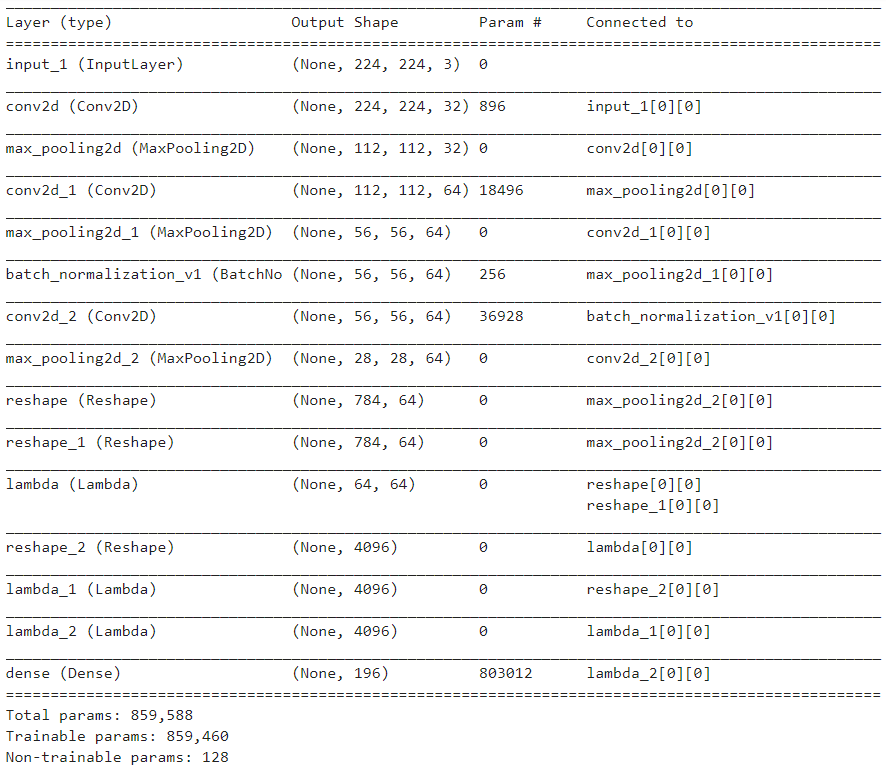

# [Grab] AI For SEA - Computer Vision Challenge

## Introduction

This is a submission to Computer Vision challenge of ***AI For SEA*** competition organised by Grab.
Given the Stanford Cars dataset [1], the goal is to recognise model and make from images of cars.

The proposed approaches are based on deep learning for image recognition, 
including Bilinear Convolutional Neural Network (BiCNN) with and without data augmentation. 

## Environment

This project was implemented using Python 3.7.1 and Keras API in TensorFlow 1.13.1
running on 8GB of RAM and NVIDIA GeForce GTX 980M. No cloud platforms were used.

Before running the codes, please install the required packages to your Python environment
by running the following command in terminal:

`pip install -r requirements.txt`

## Preprocessing

In Stanford Cars dataset, there are 8144 images belonging to 196 classes. Inside data folder,
images are organised into subfolders with respect to their class, in order for Keras'
ImageDataGenerator to work properly. All images when input to the model were resized down to 224x224 pixels and 
the set was splitted in 80/20 proportion for training and validation, respectively.

## Bilinear Convolutional Neural Network (BiCNN)

Cars model and make classification can be regarded as a fine-grained classification task,
where categories are very similar or are subcatogories of a big category (e.g. car models,
bird species, dog breeds, etc). Visual differences between classes are relatively small and
easily be affected by pose, viewpoint, or location of object in the image. Moreover, with such
litte dataset, normal CNN architecture may fail to generate good predictions as it tends to
be highly overfitted.

BiCNN was introduced to overcome those shortcomings [2]. This architecture consists of
two CNNs as feature extractors whose outputs are outer-producted at each image location and
pooled to obtain an image descriptor. In this project, the BiCNN architecture is shown below:

## Conclusion

A fully trained model was yet to be produced by the time of submission. Therefore, this project
shall be regarded as a solution proposal to the task.

## References

[1] J. Krause, M. Stark, J. Deng, L. Fei-Fei, "3D Object Representations for Fine-Grained Categorization",
*4th IEEE Workshop on 3D Representation and Recognition, at ICCV 2013 (3dRR-13)*, Sydney, Australia. Dec. 8, 2013.

[2] T. Lin, A. RoyChowdhury and S. Maji, "Bilinear CNN Models for Fine-Grained Visual Recognition," 
*2015 IEEE International Conference on Computer Vision (ICCV)*, Santiago, 2015, pp. 1449-1457.